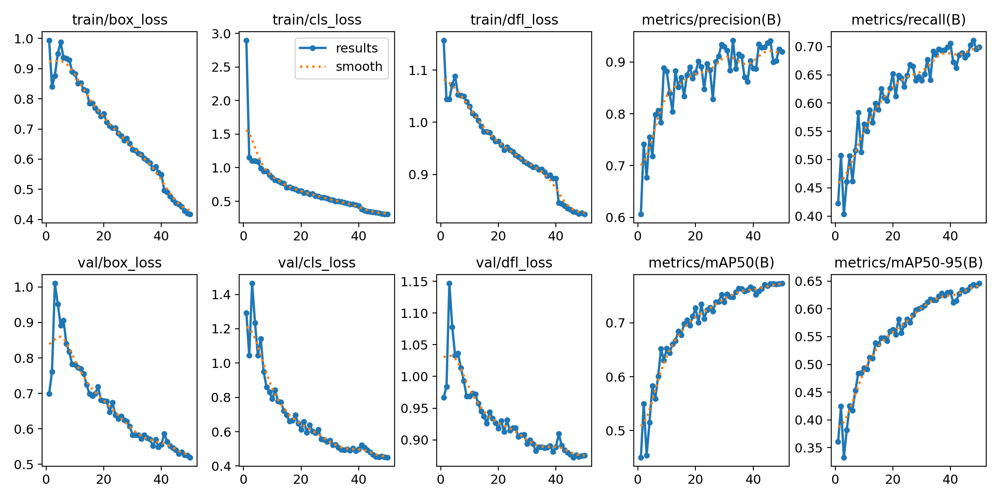
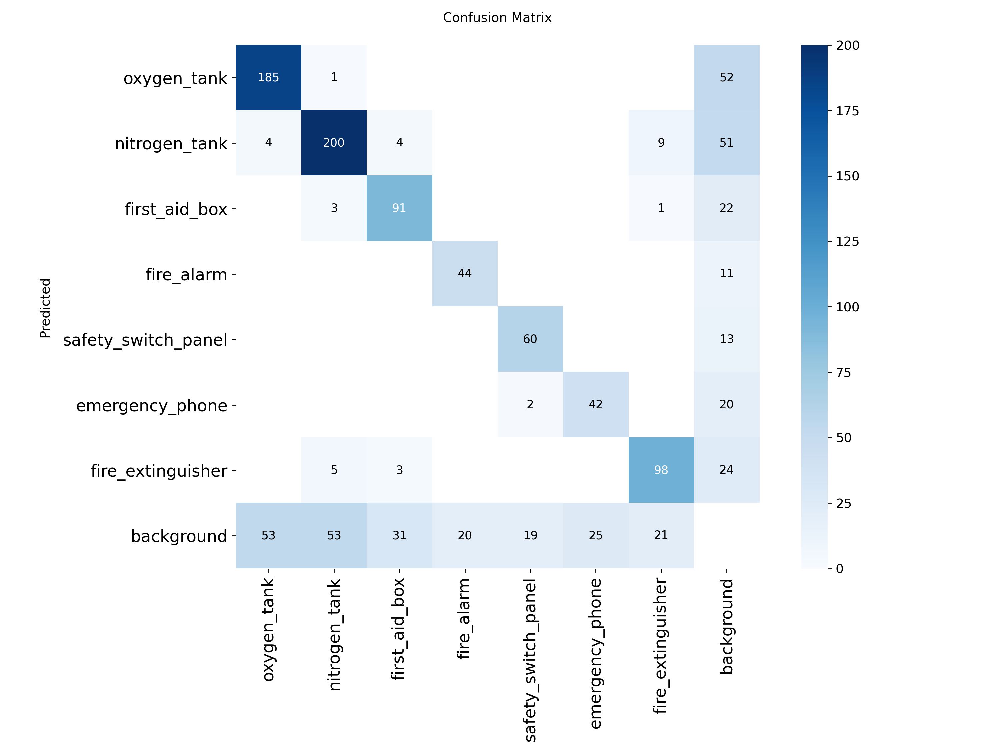
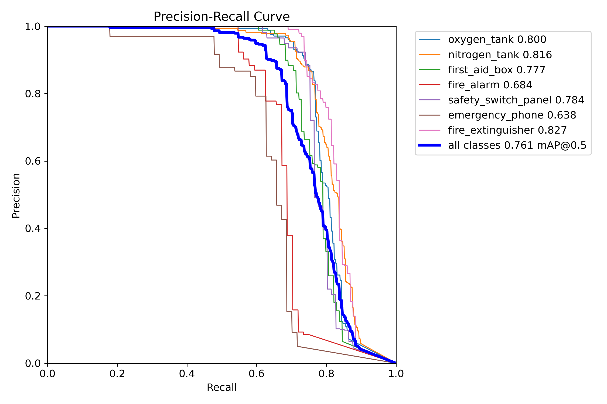

# SpaceStationSafety-YOLOv8s

## 🚀 Project Objective
The goal of this project is to train a **robust object detection model** using a **synthetic dataset** to accurately detect and classify **space station safety objects**, including:

- Oxygen tank  
- Nitrogen tank  
- First aid box  
- Fire alarm  
- Safety switch panel  
- Emergency port  
- Fire extinguisher  

This model supports **autonomous monitoring** of safety-critical equipment on a space station, reducing human error.

---

## 📂 Folder Structure

```
SpaceStationSafety-YOLOv8s/
├── README.md
├── train_yolov8.py
├── data.yaml
├── requirements.txt
├── results.png
├── confusion_matrix.png
├── BoxF1_curve.png
├── BoxPR_curve.png
```

---

## ⚙️ Setup and Installation

1. Clone the repository:

```bash
git clone https://github.com/BornCeo060605/SpaceStationSafety-YOLOv8s.git
cd SpaceStationSafety-YOLOv8s
```

2. Install dependencies:

```bash
pip install -r requirements.txt
```

---

## 🏋️ Training

Run the training script to train YOLOv8:

```bash
python train_yolov8.py
```

- Training results will be saved in:  
  `/content/drive/MyDrive/SpaceStationSafety/yolo_experiment_v2_T4`  

- **Early stopping** is enabled (patience=20) and **data augmentations** are applied for better performance.

---

## 🖥️ Inference

Use the trained model to perform inference on new images:

```python
from ultralytics import YOLO

# Load trained model
model = YOLO("runs/yolo_experiment_v2_T4/weights/best.pt")

# Perform inference
results = model.predict("path/to/image.jpg")
results.show()
```

---

## 📊 Results

- **Best Model:** `runs/yolo_experiment_v2_T4/weights/best.pt`  

**Evaluation Metrics:**

  
  

**Optional Metric Curves:**

  
  

> These images showcase accuracy, precision, recall, mAP, and class-wise performance.

---

## 🤝 Contributing

- Fork the repository  
- Create a new branch for your feature/fix  
- Commit your changes and submit a pull request  
- Ensure your code follows the structure and includes necessary documentation  

---

## 📌 License

This project is for **hackathon submission and educational purposes**.  
All rights reserved to the author.
